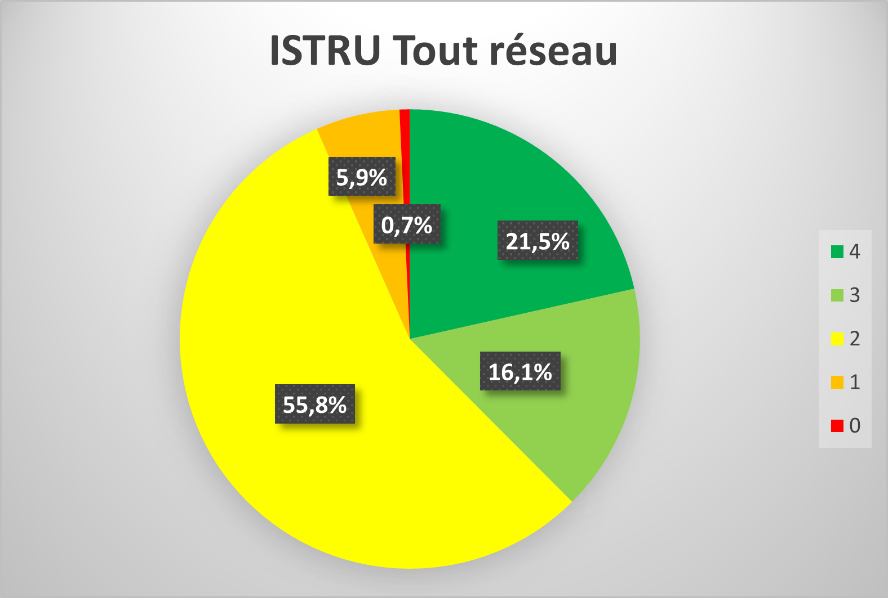

Entretien de la chaussée
========================

Indicateur ISTRU : État de structure des chaussées
----------------------------------------------------

Enjeux
   Conservation du patrimoine.

Description
   L’indicateur mesure l’état structurel des chaussées.

Méthode de calcul
   L’indicateur « ISTRU » calcule la proportion des chaussées en état structurel dégradé, en croisant deux indices intermédiaires résultats de la combinaison d’index unitaires de dégradation de surface et d’uni petites ondes dont les principes sont exposés en annexe à la présente fiche. 
   La périodicité d’auscultation est de 3 ans. Les voies lentes dans les deux sens de circulation des sections courantes d’autoroutes à l’exclusion notamment des bifurcations, des échangeurs, des aires et des plateformes de péage.  

Objectif
   NA

Mécanisme de pénalité
   NA

Propriétaire de donnnées
   2D2I

Source de données
   Fichiers Excel fournis par le prestataire et stockés sur le réseau. En 2021, le prestataire était NextRoad et en 2021 Ginger. 
   

   

Indicateur IQRA: État de surface des chaussées IQRA
----------------------------------------------------

Enjeux
      Conservation du patrimoine / sécurité des usagers.

Description
      État L'indicateur mesure la surface des chaussées.

Méthode de calcul
      La méthode prend en compte les mesures macro-texture, de CFT (coefficient de frottement transversal), d’uni longitudinal (ondes courtes) et d’orniérage. Ces deux index unitaires sont croisés deux à deux afin de définir un indicateur adhérence et un indicateur d’uni. Ces deux indicateurs sont ensuite croisés à l’aide d’un système matriciel pour définir un indicateur global dénommé « indicateur de surface ». L’indicateur est calculé annuellement. L’indicateur s’applique qu’aux sections courantes d’autoroutes et exclut notamment les bifurcations, les échangeurs, les aires et les plateformes de péage. La méthode ne s’applique pas aux chaussées en béton. 

Objectif
      L’indicateur est assorti de deux objectifs :
            * Objectif 1 : au moins 90% des notes >=3
            * Objectif 2 : au moins 95% des notes >=2

Mécanisme de pénalité
      La pénalité s’applique dès qu’un des deux objectifs n’est pas atteint.

Propriétaire de données
      2D2I

Source de données
      Fichiers Excel fournis par le prestataire et stockés sur le réseau. En 2021, le prestataire était NextRoad et en 2021 Ginger. 

